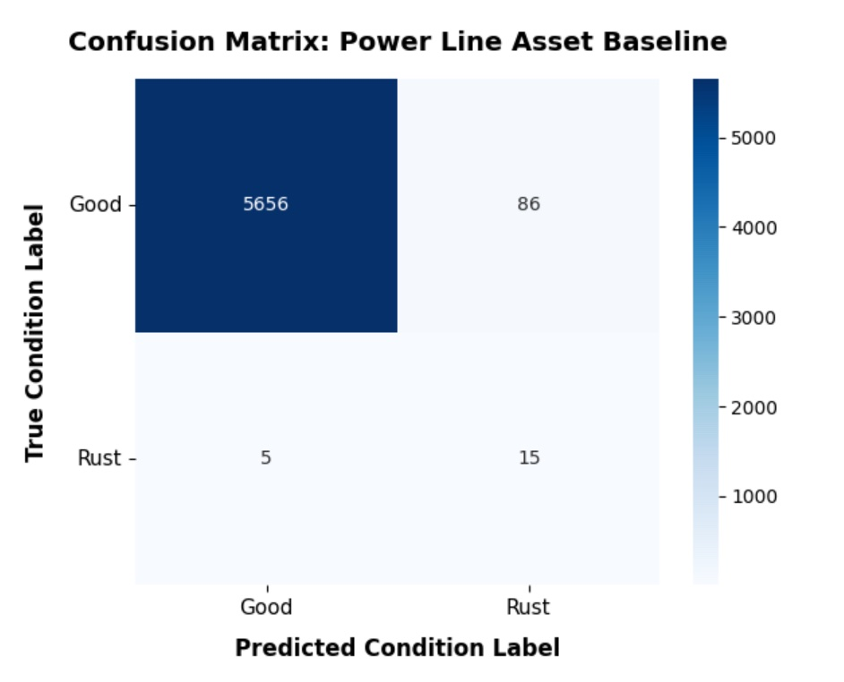
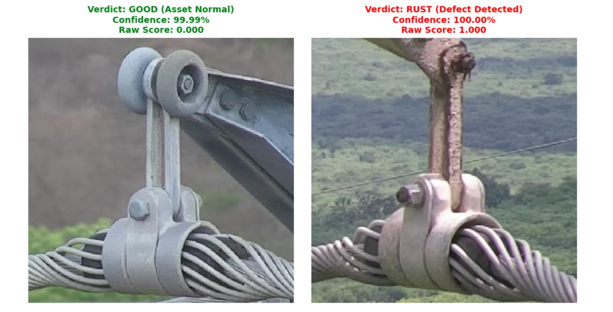
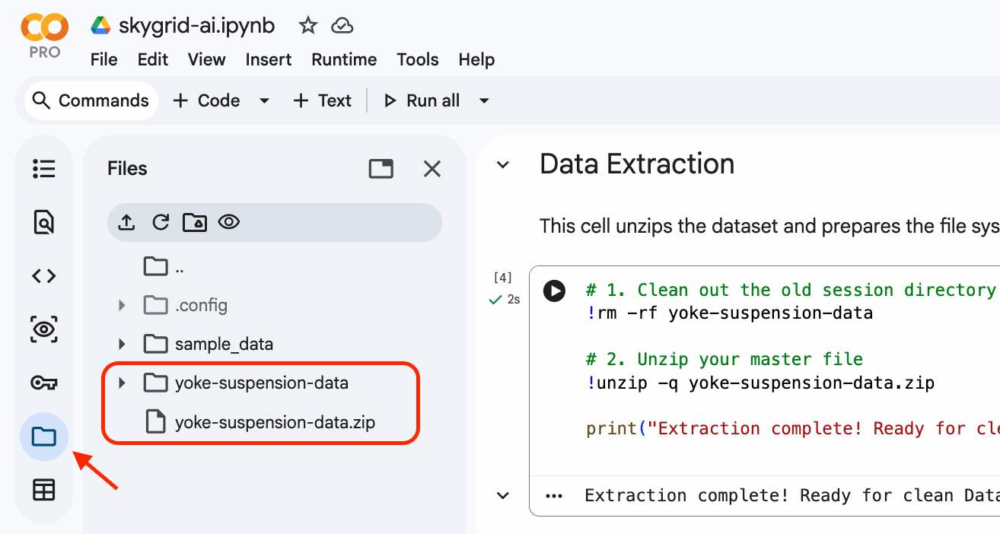
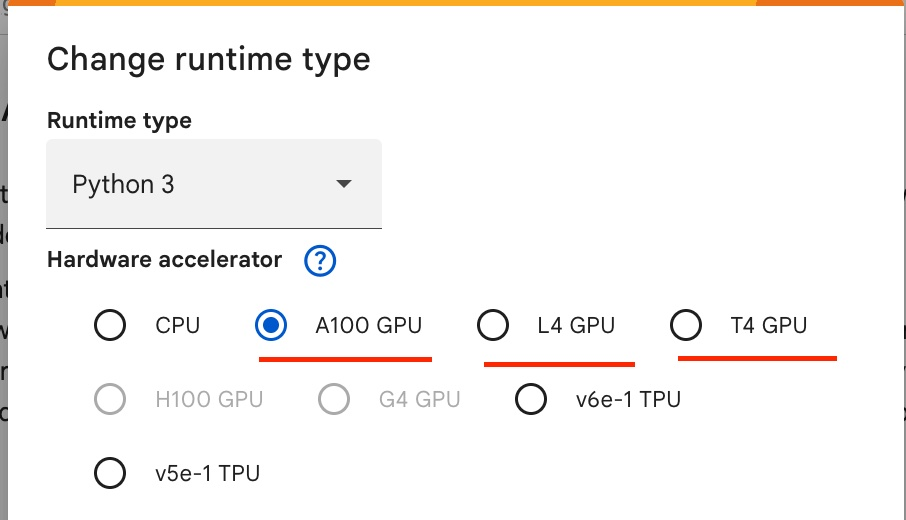
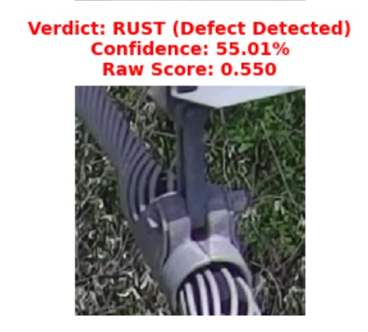

# SkyGrid AI

_An AI-powered fault detection system for power transmission assets_

## Introduction

SkyGrid AI a lightweight computer vision workflow for detecting rust and corrosion on power line components using UAV imagery. The goal is to support preventive maintenance for electrical infrastructure by helping identify deteriorated assets before they lead to outages, safety risks, or wildfire-related failures.

This project is a practical step toward automating the inspection of power towers, where drone imagery is collected on a recurring basis and processed to detect defects before they escalate into operational failures.

The project uses the InsPLAD dataset, a publicly released benchmark for power line asset inspection. The notebook builds a full image-classification pipeline from dataset preparation to model training, evaluation, and prediction on unseen images. In this implementation, the model is trained to distinguish between healthy and rusted assets.

## Why this matters

Power line inspection is expensive, time-consuming, and often difficult to scale across large grid networks. Many defects are not obvious from a quick visual check, especially when infrastructure is spread across long distances and harsh outdoor conditions. Automated inspection can help prioritize maintenance work and catch early-stage corrosion before it becomes a major failure.

InsPLAD was introduced to address this gap. The dataset includes high-resolution UAV images taken in real operating environments and captures multiple power line asset types along with different defect conditions. It supports several computer vision tasks, including object detection, defect classification, and anomaly detection.

## Repository Contents

Repository: https://github.com/ajaykanade/skygrid-ai.git

- `README.md` — project overview, methodology, and setup instructions
- `skygrid_ai.ipynb` — notebook with the complete data processing, model training, and evaluation workflow
- `images/` — screenshots and example figures for the documentation
- `yoke-suspension-data.zip` — packaged dataset used for training and validation

## Dataset

I used the InsPLAD dataset for power line asset inspection which includes:

- More than 10,000 high-resolution UAV images for 17 unique power line asset types,
- Multiple defect categories, including corrosion-related faults,
- Real-world operating conditions with clutter, perspective distortion, and varying lighting,
- Support for classification, detection, and anomaly detection tasks.

According to the original dataset description, the benchmark is designed to enable research in realistic inspection challenges rather than synthetic or highly simplified examples. This makes it especially relevant for infrastructure monitoring where complex backgrounds and imperfect imagery are common.

The project here focuses on the supervised image classification subset, where the model learns to tell the difference between a normal asset and a rusted asset. This is a practical starting point for industrial inspection pipelines and a strong baseline for more advanced detection systems.

## Project goals

This notebook is designed to demonstrate a complete CNN-based workflow for utility asset inspection:

- Prepare the dataset from a ZIP archive,
- Clean and organize labeled image directories,
- Create training and validation pipelines,
- Train a binary image classifier,
- Measure performance with confusion matrices and classification metrics,
- Make predictions on new, unseen images.

The emphasis is not only on training a model, but also on making the inspection process interpretable: the model outputs a probability score for each input image, which can be interpreted as the likelihood of corrosion or defect severity.

## Data pipeline and methodology

### Dataset preparation

The notebook unzips the packaged dataset, removes any stale workspace data, and constructs clean DataFrames by scanning the relevant class folders such as `good` and `rust`. The dataset is organized into `train`, `val`, and `test` folders. The `train` and `val` sets are used for model training and validation, while the `test` set represents unseen data used to evaluate the final model performance on data it has not seen during training.

### Preprocessing

Each image is processed before training:

- read from disk,
- decoded as a color image,
- resized to a standard input size,
- normalized to the range 0-1,
- converted into TensorFlow dataset batches for efficient training.

### Model architecture

The model uses a custom CNN built with convolutional layers, max-pooling layers, dropout, and a final sigmoid output. The output is a probability between 0 and 1:

- values near 0 indicate a healthy or non-defective asset,
- values near 1 indicate likely rust or corrosion.

This makes the model easy to interpret in an inspection workflow and works well for binary decision support.

### Evaluation

The notebook evaluates the trained model with:

- Classification reports
- Confusion matrices
- Sample visual predictions

This gives a practical view of the model’s behavior on real image content rather than only reporting one aggregate accuracy score.

#### Confusion matrix:

#### Classification report:

| Class | Precision | Recall | F1-score | Support |
| ----- | --------: | -----: | -------: | ------: |
| Good  |      1.00 |   0.95 |     0.98 |    5742 |
| Rust  |      0.05 |   0.65 |     0.09 |      20 |

Note: I know that the recall rate of 65% for rust is not that great but it was not that bad either. I tried to use class weights to give more weight to rust images, but the scores did not improve significantly. I think "data augmentation" may help here (as listed in next steps)

## Example of model prediction on unseen data

Once the model is trained, it can process a new image and automatically estimate whether the asset appears healthy or defective. In this project, the decision threshold is set at 0.5:

- score < 0.5: likely good / healthy
- score >= 0.5: likely rusted / defective

This is the core workflow for automatic inspection: a new image enters the pipeline, the model extracts visual patterns, and a probability score is produced for the defect class.

The diagram above illustrates the idea: one image is classified as healthy with a low rust score, while another is flagged as rusted with a high corrosion probability.

## Setup

This project works best on Google Colab.

1. Download the project from GitHub as follows:
   - If you have git installed, run: `git clone https://github.com/ajaykanade/skygrid-ai.git`
   - If git is not installed, go to https://github.com/ajaykanade/skygrid-ai and click Code > Download ZIP

2. Upload both the notebook and the ZIP file in Colab:
   - Open Google Colab.
   - Click "Upload notebook."
   - In the upload tab, browse and select `skygrid_ai.ipynb`.
   - Once the notebook is loaded, click the folder icon and drag the `yoke-suspension-data.zip` file into this folder. Note that this takes a while
   - After the zip is fully uploaded (**after upload spinner is done**), executing the "Data Extraction" will extract the data as shown below:

        

3. For faster training, switch to a GPU runtime:
   - Click Runtime > Change runtime type, then select a T4 GPU, A100, or L4.

        

## Next steps

Potential improvements for this project include:

- Exploring multiple defect categories beyond rust
- Automatic object detection from full pictuers
- Adding data augmentation like rotations & brightness to avoid false positives/negatives. One example is below. Looks like the shadow confused the model and image augmentation will help.

    

These next steps would move the project closer to real-world industrial inspection systems, where the goal is not just classification but actionable maintenance intelligence.

## Resources

### InsPLAD dataset, a comprehensive collection of UAV imagery

@article{doi:10.1080/01431161.2023.2283900,
author = {André Luiz Buarque Vieira e Silva, Heitor de Castro Felix, Franscisco Paulo Magalhães Simões, Veronica Teichrieb, Michel dos Santos, Hemir Santiago, Virginia Sgotti and Henrique Lott Neto},
title = {InsPLAD: A Dataset and Benchmark for Power Line Asset Inspection in UAV Images},
journal = {International Journal of Remote Sensing},
volume = {44},
number = {23},
pages = {1-27},
year = {2023},
publisher = {Taylor & Francis},
doi = {10.1080/01431161.2023.2283900},
URL = {https://doi.org/10.1080/01431161.2023.2283900},
eprint = {https://doi.org/10.1080/01431161.2023.2283900},
}

@InProceedings{Vieira_2024_WACV,
author = {e Silva, Andr\'e Luiz Vieira and Sim\~oes, Francisco and Kowerko, Danny and Schlosser, Tobias and Battisti, Felipe and Teichrieb, Veronica},
title = {Attention Modules Improve Image-Level Anomaly Detection for Industrial Inspection: A DifferNet Case Study},
booktitle = {Proceedings of the IEEE/CVF Winter Conference on Applications of Computer Vision (WACV)},
month = {January},
year = {2024},
pages = {8246-8255}
}
